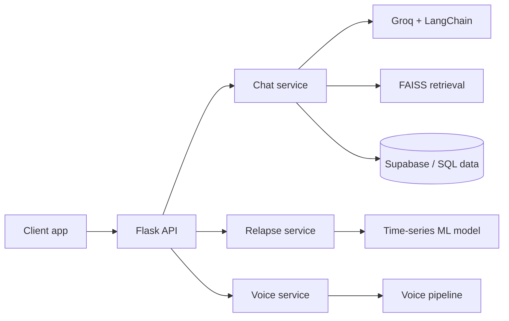
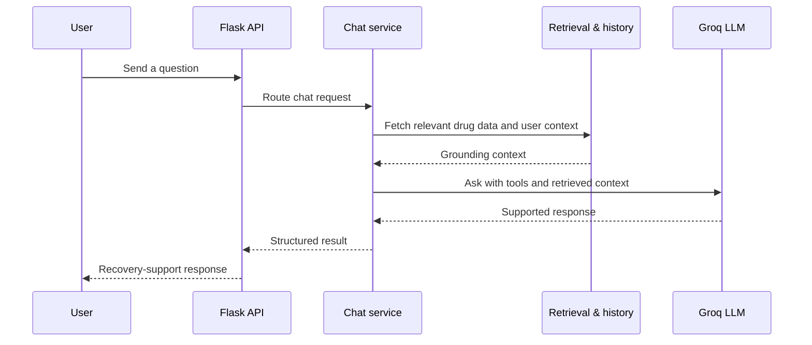

<h1>
  
  FiQ Backend
</h1>

FiQ-Backend is a "Drug Fighting & Recovery Platform" hackathon backend built with Flask, LangChain, and Supabase. It's a modular microservices architecture backing a recovery-support platform.

## Architecture

## Recovery-support request flow

## Services

- **Chat** (`backend/Chat/`) — a Groq-powered LLM agent (via LangChain) with tool-calling, retrieval-augmented generation over a drugs SQL database, web-search fallback, and user history lookup.
- **Relapse** (`backend/Relapse/`) — a time-series ML model predicting relapse risk from behavioral features (days clean, craving trend, sleep deviation, trigger count, support-session attendance, medication adherence).
- **Voice** (`backend/Voice/`) — a newer, in-progress service not yet documented in the original architecture plan.

`plan.md` documents the full intended architecture: endpoints, feature sets, logging format, and the cross-service response contract.

## Status

Git history shows real incremental progress (init → "perfect local stuff" → blog functionality). Both `Chat/` and `Relapse/` have tests (`test_chat_route.py`, `test_services.py`). A `migrate_to_supabase.py` script and ngrok tunnel config suggest the backend was exposed publicly for a live demo at some point.

The `Voice/` service is present but untracked in the original plan — its purpose and integration status aren't documented yet. Implementation completeness against `plan.md`'s detailed spec (e.g. whether every documented tool/endpoint actually exists) hasn't been independently verified beyond folder structure.

## Setup

Each service under `backend/` has its own `requirements.txt`. `init_databases.py` sets up local storage; `migrate_to_supabase.py` migrates to Supabase-backed storage.

## Stack

Python, Flask 3.0 + flask-cors, Groq API + LangChain, sentence-transformers + faiss-cpu (RAG), Supabase (Postgres).
